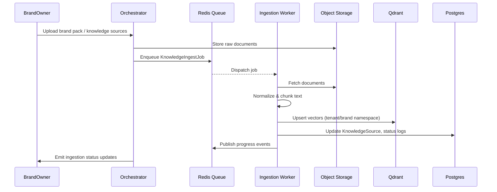
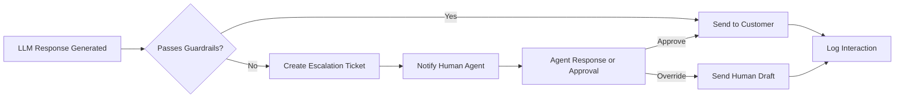

# Architecture Overview

This document summarizes the end-to-end architecture for the business messaging assistant. The system is designed as a multi-tenant, multi-channel platform that ingests brand knowledge, retrieves context through RAG, and responds autonomously to customer messages.

## Context Diagram

```mermaid
graph TD
  subgraph Channels
    IG[Instagram API]
    WA[WhatsApp Business API]
    TG[Telegram Bot API]
    WEB[Web Chat Widget]
  end

  subgraph Platform
    CG[Channel Gateway]
    ORCH[Orchestrator Service]
    ING[Ingestion Worker]
    QD[Qdrant Vector DB]
    PG[(Postgres)]
    RD[(Redis Streams)]
  end

  subgraph External
    LLM[LLM Provider<br/>(OpenAI/OpenRouter)]
    S3[(Object Storage)]
    CRM[Customer Systems]
  end

  IG --> CG
  WA --> CG
  TG --> CG
  WEB --> CG

  CG --> ORCH
  ORCH --> RD
  ORCH --> PG
  ORCH --> LLM
  ORCH --> QD

  ING --> QD
  ING --> PG
  ING --> RD
  S3 --> ING
  ORCH --> CRM
```

## Component Summary

- **Channel Gateway**: Webhooks/services per channel that normalize provider payloads into internal `InboundMessage` events, validate signatures, and push outbound responses through provider SDKs. Connected via Redis streams for async delivery.
- **Orchestrator Service**: FastAPI application handling inbound message processing, conversation state management, RAG retrieval, LLM prompt orchestration, guardrails, and automation hooks. Persist conversation context to Postgres.
- **Ingestion Worker**: Async worker that processes brand knowledge ingestion jobs, performs document normalization/chunking, generates embeddings, and writes vectors to Qdrant. Tracks job state in Postgres and emits progress notifications.
- **Vector Store (Qdrant)**: Stores per-tenant embeddings with metadata filters (persona tone, product category). Enables similarity search during conversation flows.
- **LLM Provider**: Managed API (OpenAI/OpenRouter) used for response generation. The orchestrator crafts persona-aware prompts that combine channel history with retrieved knowledge snippets.

## Request Lifecycle

1. Customer sends a message on any supported channel.
2. Channel gateway receives webhook, transforms payload to `InboundMessage`, and forwards it to the orchestrator.
3. Orchestrator loads brand configuration, pulls recent conversation history, and invokes `retrieve_context` against Qdrant using the message embedding.
4. Orchestrator builds an LLM prompt (persona directives + conversation history + retrieved snippets) and queries the provider.
5. Generated response runs through guardrails (content filters, escalation checks). Safe responses are logged to Postgres and emitted to Redis for delivery; unsafe responses are escalated to human review.
6. Channel gateway consumes outbound events and posts messages back through the provider APIs.

## Knowledge Ingestion Flow



## Escalation Loop



Escalation triggers include policy violations, low confidence scores, or explicit action requests requiring authorization. Escalations are recorded in Postgres with audit metadata.

## Data Persistence

- **Postgres** holds tenant/brand configuration, conversation history, knowledge metadata, and job tracking.
- **Redis Streams** enable back-pressure-friendly communication between orchestrator and channel adapters; Pub/Sub topics broadcast ingestion progress.
- **Qdrant** stores embedding vectors with metadata filters to keep brand data isolated.
- **Object Storage** retains original knowledge documents for reprocessing and compliance.

## Operational Notes

- Maintain namespace separation per tenant/brand across storage systems.
- All services emit structured logs with correlation IDs to facilitate tracing across components.
- Observability stack (OpenTelemetry + Prometheus) tracks end-to-end latency, LLM usage metrics, and ingestion throughput.
- Disaster recovery relies on regular snapshots of Postgres/Qdrant and versioned storage of knowledge assets.
