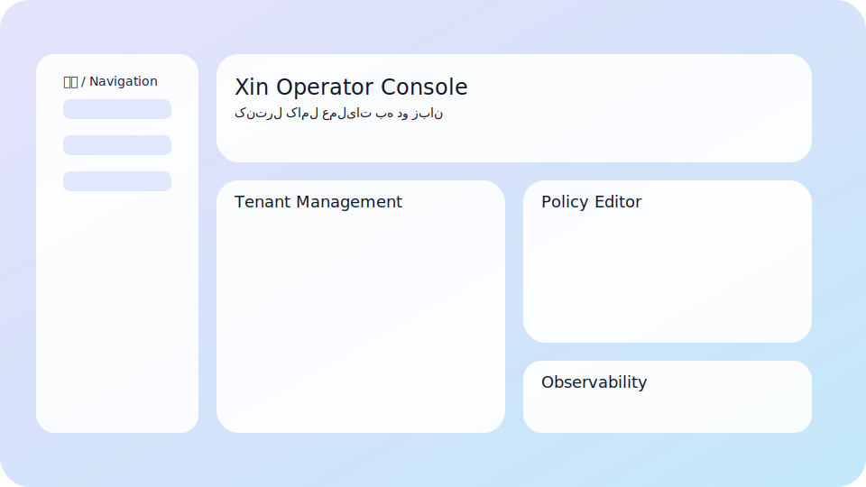

# Phase 3 — Operator Console



## Overview

The `services/frontend` Vite + React console completes Phase 3 by exposing every operator workflow required in `docs/ROADMAP.md` and `docs/RUNBOOK.md §§5–7`. Bilingual UX (English + Persian) and RTL/LTR layout shifts are handled by the shared i18n bundle and Tailwind tokens.

## Features

| Surface | Highlights |
| --- | --- |
| Tenant Management | Global search, inline edits, channel overview, audit trail with scopes (`platform_admin`, `tenant_operator`). |
| Channel Wizard | Multi-step Instagram/Telegram/WhatsApp/Web setup, secret copy UX, webhook checklist mirroring Runbook §5. |
| Policy Editor | Schema-driven form + Monaco editor, diff viewer, diagnostics/test prompt wired to `/admin/diagnostics/retrieval`. |
| Knowledge Board | tus/resumable uploads, ingestion progress/logs, retry/cancel actions. |
| Automation Builder | Visual rule composer, live JSON preview, job status widget, pause/resume toggles. |
| Observability | Prometheus parser (latency, ingestion lag, automation queue) and Grafana snapshot embed hook. |

## Tooling & Commands

```bash
cd services/frontend
pnpm install
pnpm lint && pnpm test        # ESLint + Jest/RTL
pnpm storybook                # Component QA
pnpm dev                      # Local dev server (mock adapter optional)
pnpm e2e                      # Cypress smoke (English + Persian flows)
```

Quality gates:

- Lighthouse ≥90 (run `pnpm exec lhci autorun` after `pnpm build`).
- Cypress suite executes onboarding + policy publish flows in under 5 minutes.
- RTL snapshot review script: `pnpm exec cypress run --env locale=fa`.

## Deployment

- `pnpm build` writes artifacts to `services/frontend/dist`.
- Dockerfile `services/frontend/Dockerfile` packages the static bundle with Nginx.
- Docker Compose + Helm chart gained a `frontend` service referencing `/dist`, ensuring the operator console is served alongside backend services.
- Production keeps that container online at `http://127.0.0.1:4173` (`ports: ["4173:80"]`). After each release run
  `docker compose --env-file ../config/compose.env build frontend && docker compose --env-file ../config/compose.env up -d frontend` so the CDN-facing bundle stays fresh.
- `/etc/nginx/sites-available/xin.conf` routes `/` to the frontend container, `/api/` to the FastAPI orchestrator (`127.0.0.1:8000`), and `/webhooks/` to the channel gateway (`127.0.0.1:8080`). Reload Nginx and purge the CDN cache so the operator console is visible immediately.
- Console login requires a `platform_admin` JWT created via the snippet in `README.md#admin-token-bootstrap`; export it as `ADMIN_TOKEN` for CLI parity.

## Observability & Audit

- React Query surfaces request timing, with interceptors injecting `X-Trace-Id` plus tenant headers for trace correlation.
- Audit metadata is rendered inline with bilingual captions; RBAC toggles hide mutation controls when the scope is insufficient.
